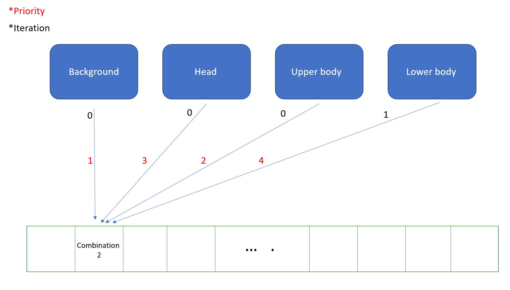
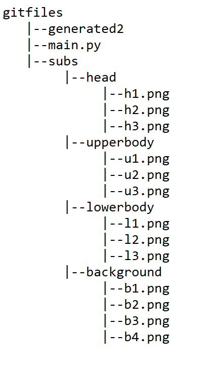
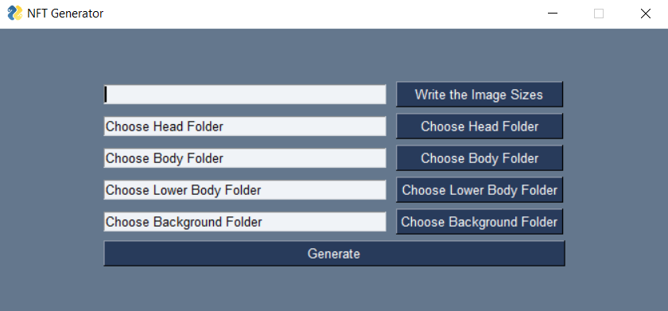

# NFT - Generator

This Application helps you create NFT with GUI.

## What is NFT Generator ?

Combining and overlaying image datas on top of each other from 4 categories. The categories can vary from background to body-parts. In the following parts of the README.md i will generally refer the category as body-parts. 

## Demo

This demo is a demonstration for the NFT project "ANANASMAN", which showcases the combination of 3 body-parts and 1 background category. The GUI usage is quite simple as it can be seen from the demo video.

## How it works?

Running through every possible combination of the given categories is the principal of the script. Then overlaying the combination in the correct order (Background->Upper body->Head->Lower body) gives the result. Although this may seem like permutation since it looks like an order, the Sequencing is only neccessary for the overlaying. So for example with 4 combined categories each having 5 images would give us 5x5x5x5 images, which is 625. (I will look to the definition of this iterative process again)

## Running the Script

The Application has (yet) no executable file, so running it directly from terminal or jupyter notebook (DEMO) is what i would recommend.

## How to prepare the necessary data?

The most vital data is the body-part data, which has (for now) 4 sub paths.

The body-part paths and "generated2" path  should exist in following directorial tree way:

## GUI Part

 With the help of pysimplegui i've added a simple user interface to the script, which makes the path selection way faster. This way, we can also give the size for the output data. The size is by default set to 512x512
 
 # Showcase
 

 
## Suggestions

Adapting to dynamic changes and creating new variables for body parts can make the script more useful.

## Conclusion

The script is able to generate simple NFT sets without taking the rarity factor into account. Combining a python
script with GUI brings new challenges for the optimization, hence the script is slower if we compare the GUI version
with raw terminal script.

Created by Can Günen
